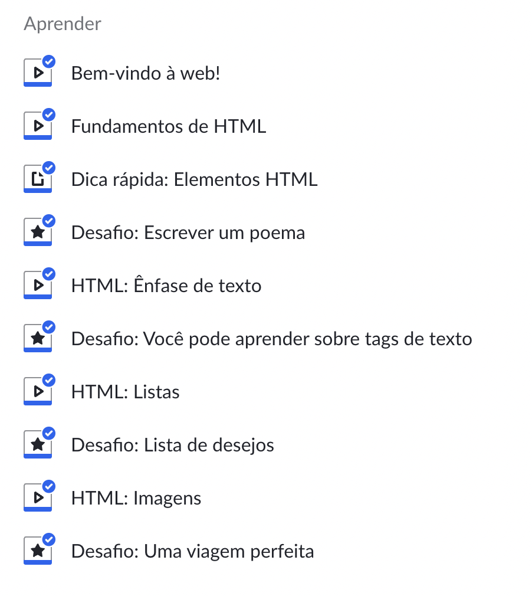

# Switch case

Se a condição for correspondida, o programa executa as instruções asssociadas. Se múltiplos casos corresponderem o valor, o primeiro caso que corresponder é selecionado, mesmo se os casos não forem iguais entre si.


Ou seja, com **switch case** conseguimos executar diferentes blocos de código de acordo com diferentes condições.

Sintaxe

```javascript
switch(expressão){
 case n1:
    bloco de código 1
    break;
 case n2:
   bloco de código 2
   break;
 default:
   bloco de código 3
}
```

Exemplo

```javascript
let num = 2

switch (num) {
    case 1:
        console.log("Número escolhido 1");
        break;
    case 2:
        console.log("Número escolhido 2");
        break;
    case 3:
        console.log("Número escolhido 3");
        break;
    default:
        console.log("Numero desconhecido");
}
```

.png>)

### Break

Caso break seja omitido, o programa continua a execução para a próxima instrução dentro de switch.

No exemplo que utilizamos ao encontrar o case 2, a execução não é parada e irá rodar também o caso seguinte independentemente do critério ter sido correspondido ou não.

```javascript
let num = 2

switch (num) {
  case 1:
    console.log("Número escolhido 1");
  case 2:
    console.log("Número escolhido 2");
  case 3:
    console.log("Número escolhido 3");
  default:
    console.log("Numero desconhecido");
}
```


