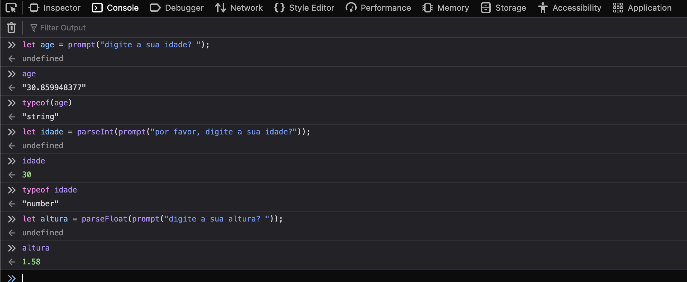

# Float ou Int

### Quando usar float ou int ?

Exemplo: Temos um programa que pergunta a idade da pessoa\


```javascript
let age = "Informe a sua idade, por favor?"; //18
console.log(age) // "18"
```

Se não colocarmos o **parseInt** ou **parseFloat,** será retornado uma string.\
Como precisamos que _**age**_ seja um **number**, precisamos passar uns dos dois(int/float), nesse caso queremos a idade fechada, sem os meses.\
Ou seja, será **int**.

```javascript
let age = parseInt("Informe a sua idade, por favor?"); //18.6
console.log(age) // 18
```

Agora digamos que estamos em uma loja e precisamos saber o valor de um produto.\


```javascript
let price = "Olá, quanto custa esse chocolate? "; // 4.50
```

Como o **preço pode ter decimais**, nesse caso usariamos o **float**.

Para converter a variável para tipo number float, utilizamos o **parseFloat()**;

```javascript
let price = parseFloat("Olá, quanto custa esse chocolate? "); //4.50
console.log(price) //4.50
```

Mais exemplos:



### Resumo

<table><thead><tr><th width="150">Number</th><th width="150">Exemplo</th><th width="150">Converter</th><th>Exemplo</th></tr></thead><tbody><tr><td><strong>Int</strong></td><td>let num = <strong>13</strong></td><td><strong>parsInt()</strong></td><td>let idade = <strong>parseInt</strong>("Informe a sua idade");</td></tr><tr><td><strong>Float</strong></td><td>let num = <strong>10.11</strong></td><td><strong>parsFloat()</strong></td><td>let idade = <strong>parseFloat</strong>("Informe a sua idade");</td></tr></tbody></table>

